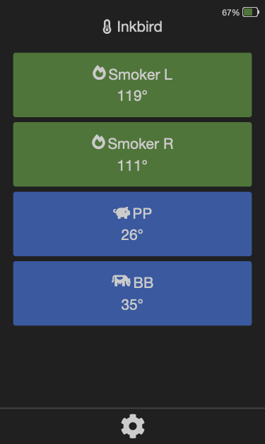

# esp32_ble_inkbird

## description

With this project you can connect any (?) inkbird bluetooth BBQ thermometer, to an ESP32. The ESP than provides a webserver with some nice functions.

---

## functions

- detects any number of probes automatically and only displays the connected ones on the [website](#anchor_inkbird_home)
- shows the battery level on the website
- you can [configure](#anchor_inkbird_setting) custom names, threshold temperatures with colors and [icons](#anchor_inkbird_icons) for each probe 
    - the configuration will be stored in the local storage of your clients webbrowser. so you can use different configurations on different clients
- default, the ESP only connects to the inkbird if you open the website and disconnects if you close it. This saves battery of the inkbird (at least this is my assumption and first tests confirm this). If you 
- while searching and connecting to the inkbird, the website shows a [loading animation](#anchor_inkbird_loading) and if there is any error, the website also shows an [error message](#anchor_inkbird_error). 
- the webserver path `/data` provides the probe(s) and battery values in JSON fomat

---

## install

- set your wifi name/password and your preferred mdns name for the ESP in the `config.h` 
    - your ESP is afterwards reachable via his IP or `your_mdns_name.local` 
- make sure you have all needed [libraries](https://github.com/espressif/arduino-esp32/tree/master/libraries) installed in your Arduino IDE

    ```
    <WebServer.h>
    <ESPmDNS.h>
    <BLEDevice.h>
    <BLEScan.h>
    <BLEAdvertisedDevice.h>
    <Preferences.h>
    ```

- depending on the used ESP32 model, you may have to use `Huge App (No OTA)` as `Partition Scheme`
- flash the ESP and have fun :)

---

## previews

- start/home page

<p align="center">
    <a name="anchor_inkbird_home"></a>
    
</p>

- settings page

<p align="center">
    <a name="anchor_inkbird_setting"></a>
    
</p>

- selectable icons 

<p align="center">
    <a name="anchor_inkbird_icons"></a>
    
</p>

- loading animation

<p align="center">
    <a name="anchor_inkbird_loading"></a>
    
</p>

- error message

<p align="center">
    <a name="anchor_inkbird_error"></a>
    
</p>

---

## credits

thanks to the following projects, I'm sure you will find a lot of your code here :D 

https://github.com/Nigho/ibbq-gateway

https://github.com/dereulenspiegel/ibbq-gateway
